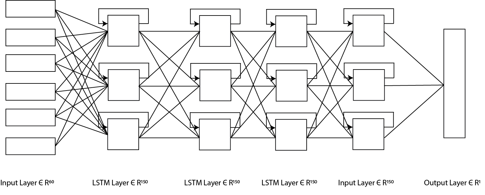

# Smartcare Machine Learning
## Modelo

Local onde se encontrará a parte mais técnica referente a deep learning, a construção e treinamento das redes neurais artificiais (ANN). Confira [clicando aqui](https://github.com/Unilasalle-SmartCare/smartcare-machinelearning/tree/master/modelo)

## Servidor
Local onde são carregadas as informações do modelo já treinado, será como uma api que ao receber requisições com dados de movimento retornará a previsão se o idoso está estressado ou não. Confira [clicando aqui](https://github.com/Unilasalle-SmartCare/smartcare-machinelearning/tree/master/server)

## Lançamentos
Visando uma maior facilidade em juntar as features e fixes desenvolvidas no projeto, você pode ver os lançamentos (releases)  [clicando aqui](https://github.com/Unilasalle-SmartCare/smartcare-machinelearning/releases).

